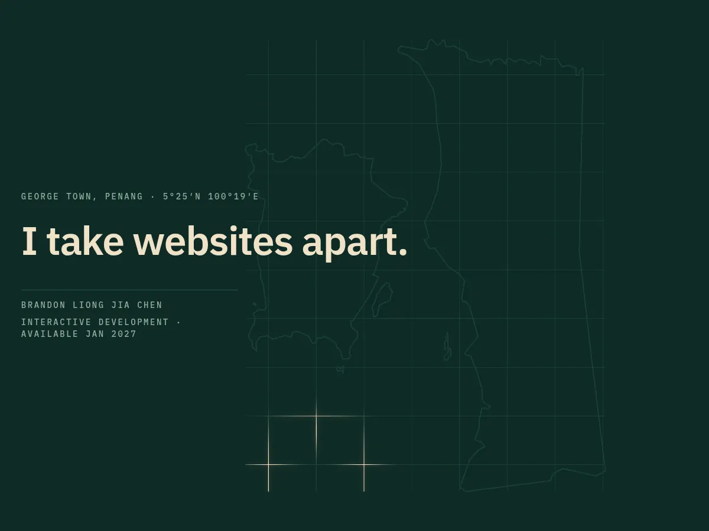

# Portfolio — Brandon Liong Jia Chen

**Live:** https://bravopacino.github.io/Portfolio/



A one-page portfolio. It opens on a line drawing of Penang lit by a moving light and ends as a printed drawing sheet, with an exploded view of the page itself.
Inside are two projects: [Unofficial Project](https://github.com/BravoPacino/unofficial-project) and [PC Build Configurator](https://github.com/BravoPacino/pc-build-configurator).

## Stack

- Vanilla JavaScript and CSS, bundled with Vite. No framework.
- GSAP ScrollTrigger for the pinned sections, Lenis for smooth scrolling and snap points.
- A hand-written WebGL2 shader draws the Penang map and the light.
- IBM Plex Sans and Mono, self-hosted through Fontsource.

## Structure

| Folder | What is in it |
|---|---|
| `src/core` | Module system, scroll setup, pinning, the WebGL light |
| `src/modules` | One file per behaviour: preloader, hero, rolodex, work rail, case pages, ending, cursor |
| `src/styles` | Design tokens, base, layout, case pages |
| `public/work` | Project screenshots |

## Run locally

```bash
npm install
npm run dev
npm run build
```

## Notes

Built with an AI coding assistant, directed and reviewed by me.
The performance figures on the page are measured, not estimated.
